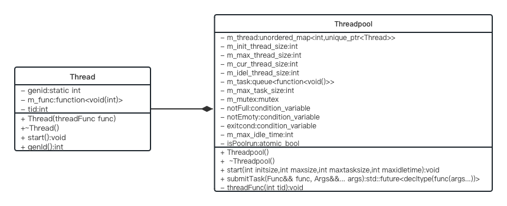

基于C++11实现的可变参数模版线程池
========================
一.项目整体介绍
------------
	1.基于C++11的可变参数模板编程实现的接受任意任务函数任意个数参数的线程池										
	2.基于C++11的future与packaged_task 实现获取提交任务的返回值	
	3.基于C++11的条件变量与互斥锁实现线程间通信	
	4.基于c++11的智能指针自动管理线程池中线程对象生命周期	
	5.当任务数量太多时支持自动创建线程，当空闲时超时回收线程	
	6.线程池析构时自动进行资源回收	
	7.暴露用户初始化接口start()初始化线程池数量 最大线程数量 最大任务数量 超时回收时间 	
	8.暴露用户提交任务函数接口submitTask() 输入任务执行函数 和参数																																	
二.实现思路
---------------
    1.线程池类需要包含一个线程容器,一个任务容器。   
    2.线程容器需要额外的变量记录 初始化线程个数 当前线程个数 最大线程个数 空闲线程个数实现线程不够时的自动创建  
    3.任务容器需要一个变量记录 最大任务个数 防止用户提交太多任务。  
    4.多线程程序,操作临界资源需要互斥锁。临界资源包括 当前线程个数 空闲线程个数 线程与任务容器  
    5.任务容器与线程容器是生产者消费者模型 任务队列不为空 线程从中取任务执行 需要两个条件变量   
    6.cached模式下用户可以自定义线程超时回收时间    
    7.fixed模式与cached模式 暴露给用户初始化接口定义初始化线程个数 最大线程个数 最大任务个数 线程最大超时回收时间   
    8.cached模式下根据空闲线程数量与当前任务数量自动创建新线程  
    9.超时回收函数即线程距离上一次执行时间超过60s自动回收之前新建的线程 
    10.线程容器包含线程类 其中需要有线程id用来后续回收线程 线程实际执行的函数(从任务队列取任务执行)     
    11.任务容器即提交的函数     
    12.暴露给用户的提交任务函数submitTask 基于可变参数模板实现  decltype自动推导返回值类型  
    13.为了获取返回值用std::packaged_task封装提交的任务 std::future获取异步操作返回的结果   
三.UML类图
-------------
    

四.思考
-----------
    1.为什么需要线程池？
	
        1.1 理解并发与并行 
		
            并发:单核CPU上，进程通过时间片轮转的方式占用CPU资源，看起来像是多个线程共同执行一样
            并行:多核或者多CPU,多个进程同时执行。
            PS:深度探索可以参考os进程调度的章节
        1.2 多线程一定好吗？
		
            不一定
            IO密集型程序，无论单核多核还是多CPU多线程一定好
            CPU密集型程序，单核CPU多线程不一定好，因为多线程存在上下文切换
            PS:如何减少上下文切换？
        1.3 线程池的优势
		
            操作系统上创建线程和销毁线程都是很"重"的操作，耗时耗性能都比较多，那么在服务执行的过程中，如果业务量比较大，实时的去创建线程、执行业务、业务完成后销毁线程，那么会导致系统的实时性能降低，业务的处理能力也会降低。
            线程池的优势就是，在服务进程启动之初，就事先创建好线程池里面的线程，当业务流量到来时需要分配线程，直接从线程池中获取一个空闲线程执行task任务即可，task执行
            完成后，也不用释放线程，而是把线程归还到线程池中继续给后续的task提供服务。
五:遇到的问题
-------------
    1.在其他都没有问题情况下，创建多个线程只有一个线程执行任务。
        线程拿锁时间太久，更改锁的作用域。
    2.资源回收时发生死锁问题，导致线程无法退出。
        1.定位死锁位置 线程退出时 先notEmpty.notify_all(); //唤醒所有消费者线程 或锁 造成死锁
        2.解决 析构函数先获取锁  threadfunc 锁➕双重判断 有任务在wait
    3.如何让threadpool出作用域 提交的任务执行完？
        threadfunc中while改为for 让任务必须执行完
    4.重载函数会提交失败
        在submitTask时候重载函数无法在编译期推导出返回值类型，需要绑定函数指针使用。
六:学到的知识
-----------
    1.c++11的新特性 std::function std::bind std::packaged_task std::future 
    2.c++11多线程编程相关 互斥量 条件变量 原子变量
    3.c++11可变参数模板与返回类型后置语法
    4.git用法
   
 七:补充知识
 ----------
    1.这里的多线程指用户线程
    2.用户线程与内核线程对应关系有三种
    	1.一对一
	  线程之间真正的并发执行，多核CPU对应多少个线程 优点:一个线程阻塞其他也不受影响，多处理器上性能更好。缺点：1.用户线程数量受到限制 2.内核线程调度时上下文切换开销较大，导致用户线程执行效率下降
	2.多对一
	   一个内核线程对应多个用户线程，缺点：一个阻塞其他阻塞，优点：上下文切换高效，线程数量几乎不限制
	3.多对多
	   优点：集中另外两个模型优点，线程数量不限制，一个阻塞其他不影响，但是性能没有一对一好。
	PS:用户线程与内核线程切换 涉及到用户态到内核态的切换，OS中详细讲述
	   
       
